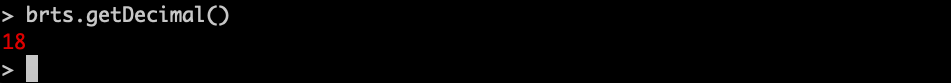

# 发行隐私币

## 启动节点

隐私币发行前推荐大家在开发网测试一下，因此本文就以开发网开始，`Alpha`/`Beta`/`Mainnet`正式网类似。

打开第一个终端，并启动一个带`console`的节点。为了省事，我编辑了一个脚本，直接解锁并开启挖矿（此方法仅限于用户开发网络，正式网不推荐）。



```bash
export LD_LIBRARY_PATH=$GOPATH/src/github.com/sero-cash/go-czero-import/czero/lib
gero --dev --datadir /path/to/sero/datadir/dev --devpassword 'password' --mine --minerthreads 1 console
```



如果一切正常，会输出版本号等提示，并进入控制台。

```bash
Welcome to the Gero JavaScript console!

instance: Gero/v0.7.0-beta.r7-hotfix.1/darwin-amd64/go1.12
coinbase: 4CZWS8sPWqi2CLFVKANJsif9xSEYVBFG42ma84P4VNghWBrEQAVL9ATELwYJF4FPkSnsMyj9fVSJbmjfj4JbYJ2Y
at block: 2082 (Fri, 26 Apr 2019 14:36:50 CST)
 datadir: /path/to/sero/datadir/dev
 modules: admin:1.0 debug:1.0 miner:1.0 net:1.0 personal:1.0 rpc:1.0 sero:1.0 txpool:1.0 web3:1.0

>
```

控制台的这个终端，还会时不时的输出日志，一会儿会用到这些日志。

现在打开第二个终端，`attach`进这个节点，用于部署合约。

```text
export DYLD_LIBRARY_PATH=$GOPATH/src/github.com/sero-cash/go-czero-import/czero/lib
gero --datadir /path/to/sero/datadir/dev attach
```

同样的，成功后，会输出类似的提示，然后进入控制台。

## 源码

打开网址[https://remix.web.sero.cash/\#optimize=true&version=builtin](https://remix.web.sero.cash/#optimize=true&version=builtin)，会自动出现示例代码，新建一个源码文件，然后输入`Solidity`源码，如下



```javascript
pragma solidity ^0.4.16;

import "browser/seroInterface.sol";

library SafeMath {
    function safeMul(uint256 a, uint256 b) pure internal returns (uint256) {
        uint256 c = a * b;
        assert(a == 0 || c / a == b);
        return c;
    }

    function safeDiv(uint256 a, uint256 b) pure internal returns (uint256) {
        assert(b > 0);
        uint256 c = a / b;
        assert(a == b * c + a % b);
        return c;
    }

    function safeSub(uint256 a, uint256 b) pure internal returns (uint256) {
        assert(b <= a);
        return a - b;
    }

    function safeAdd(uint256 a, uint256 b) pure internal returns (uint256) {
        uint256 c = a + b;
        assert(c>=a && c>=b);
        return c;
    }
}

contract HasOwner {
    address public owner;

    constructor() public {
        owner = msg.sender;
    }

    modifier onlyOwner {
        require(msg.sender == owner);
        _;
    }

    function transferOwnership(address newOwner) onlyOwner public {
        owner = newOwner;
    }
}

contract BORONGTS is SeroInterface, HasOwner {
    
    using SafeMath for uint256;
    // Public variables of the token
    uint8 constant DECIMALS = 18;
    uint256 public totalSupply;
    string public tokenSymbol = "BORONGTS";
    
    constructor(uint256 initSupply, string tokenName) public payable {
        totalSupply = initSupply *10** uint256(DECIMALS);
        require(sero_issueToken(totalSupply, tokenName));
        tokenSymbol = tokenName;
    }
    
    function getDecimal() public pure returns (uint8) {
        return DECIMALS;
    }
        
    function transfer(address _to, uint256 _value) public onlyOwner {
        require(sero_balanceOf(tokenSymbol) >= _value);
        require(sero_send_token(_to,tokenSymbol,_value));
    }
    
    function reclaimSero(address _to) external onlyOwner {
        _to.transfer(address(this).balance);
    }
    
    function totalSupply() public view returns (uint256) {
        return totalSupply;
    }
}
```



其中，合约的名字叫做`BORONGTS`，币的名称也叫`BORONGTS`，18位，总发行量可以在构造函数里指定。

```text
contract BORONGTS is SeroInterface, HasOwner {
    
    using SafeMath for uint256;
    // Public variables of the token
    uint8 constant DECIMALS = 18;
    uint256 public totalSupply;
    string public tokenSymbol = "BORONGTS";
    
    constructor(uint256 initSupply, string tokenName) public payable {
        totalSupply = initSupply *10** uint256(DECIMALS);
        require(sero_issueToken(totalSupply, tokenName));
        tokenSymbol = tokenName;
    }
    
    // ...其他代码...
    
}
```

你也可以按照自己的喜好，起一些其他的名字，6个字母以上，可以带下划线或者数字。

## 命令



